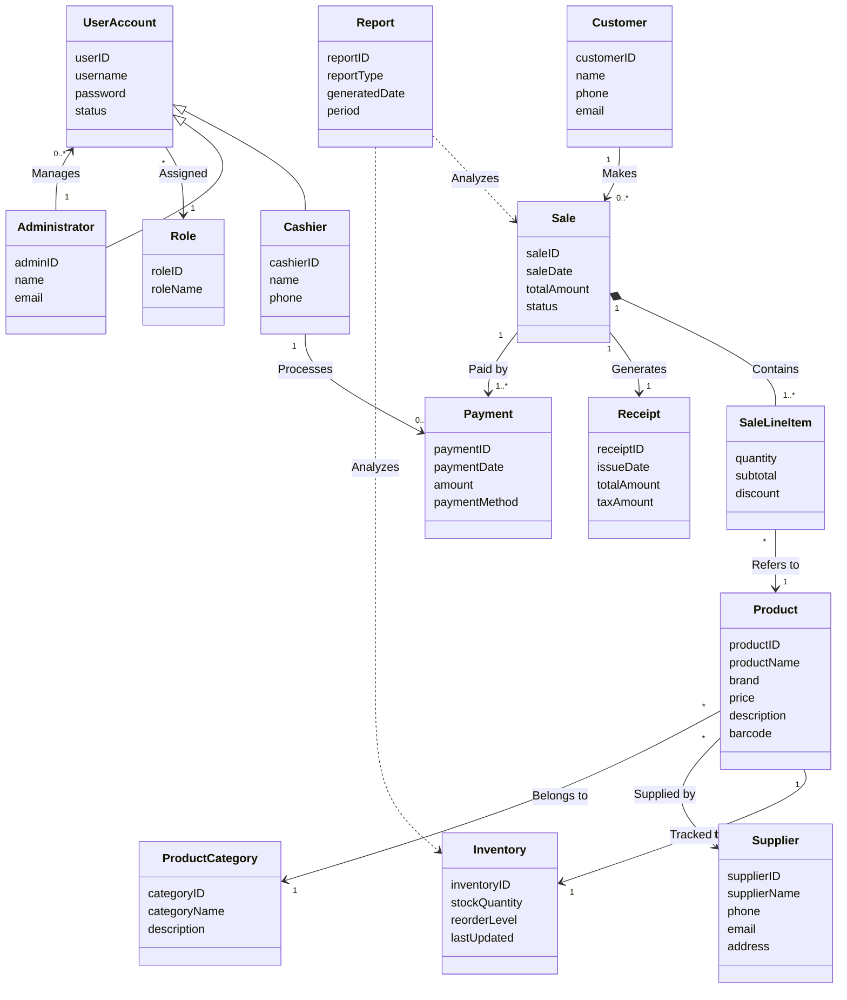

# Domain Model — Conceptual Class Diagram

## Conceptual Classes

| Class | Attributes | Responsibility |
|---|---|---|
| **Sale** | saleID, saleDate, totalAmount, status | Represents one completed or in-progress transaction at the register. |
| **SaleLineItem** | quantity, subtotal, discount | One line of a Sale — a product and how many of it were sold. |
| **Product** | productID, productName, brand, price, description, barcode | An item the store sells. |
| **ProductCategory** | categoryID, categoryName, description | Groups products (e.g. "Phones", "Laptops", "Accessories"). |
| **Inventory** | inventoryID, stockQuantity, reorderLevel, lastUpdated | Tracks how much stock exists for a Product and when to reorder. |
| **Supplier** | supplierID, supplierName, phone, email, address | A vendor that supplies Products to the store. |
| **Payment** | paymentID, paymentDate, amount, paymentMethod | Records how a Sale was paid for. |
| **Receipt** | receiptID, issueDate, totalAmount, taxAmount | The proof-of-purchase generated for a completed Sale. |
| **Customer** | customerID, name, phone, email | A person making a purchase (optional/loyalty customers). |
| **Report** | reportID, reportType, generatedDate, period | A generated sales or inventory report. |
| **UserAccount** | userID, username, password, status | Login credentials and account status for any system user. |
| **Role** | roleID, roleName | A named permission set (e.g. Cashier, Administrator) assigned to a UserAccount. |
| **Cashier** *(specializes UserAccount)* | cashierID, name, phone | A staff member who processes sales and payments. |
| **Administrator** *(specializes UserAccount)* | adminID, name, email | A staff member who manages products, users, and reports. |

## Associations

| From | Relationship | To | Multiplicity |
|---|---|---|---|
| Sale | Contains | SaleLineItem | 1 Sale — 1..* SaleLineItem |
| SaleLineItem | Refers to | Product | * SaleLineItem — 1 Product |
| Product | Tracked by | Inventory | 1 Product — 1 Inventory |
| Product | Supplied by | Supplier | * Product — 1 Supplier |
| Product | Belongs to | ProductCategory | * Product — 1 ProductCategory |
| Sale | Generates | Receipt | 1 Sale — 1 Receipt |
| Sale | Paid by | Payment | 1 Sale — 1..* Payment |
| Customer | Makes | Sale | 1 Customer — 0..* Sale |
| Cashier | Processes | Payment | 1 Cashier — 0..* Payment |
| UserAccount | Assigned | Role | * UserAccount — 1 Role |
| Administrator | Manages | UserAccount | 1 Administrator — 0..* UserAccount |
| Report | Analyzes | Sale | analytical/derived, not a stored FK |
| Report | Analyzes | Inventory | analytical/derived, not a stored FK |

## Generalization

`Cashier` and `Administrator` are both specializations of `UserAccount` — they inherit userID/username/password/status and add their own identifying attributes.

## Mermaid Reproduction

*Note: this diagram carries attributes only — no methods — because a conceptual class diagram in Inception/Elaboration Iteration 1 models real-world concepts and data, not software behavior. Methods and controller classes are introduced in `design_class_diagram.md` (Elaboration Iteration 2), once analysis is complete.*