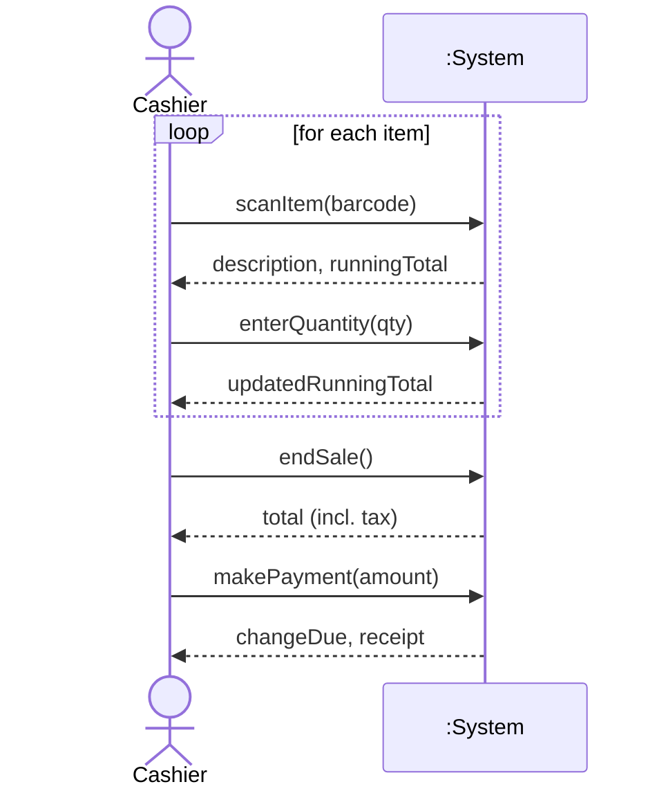
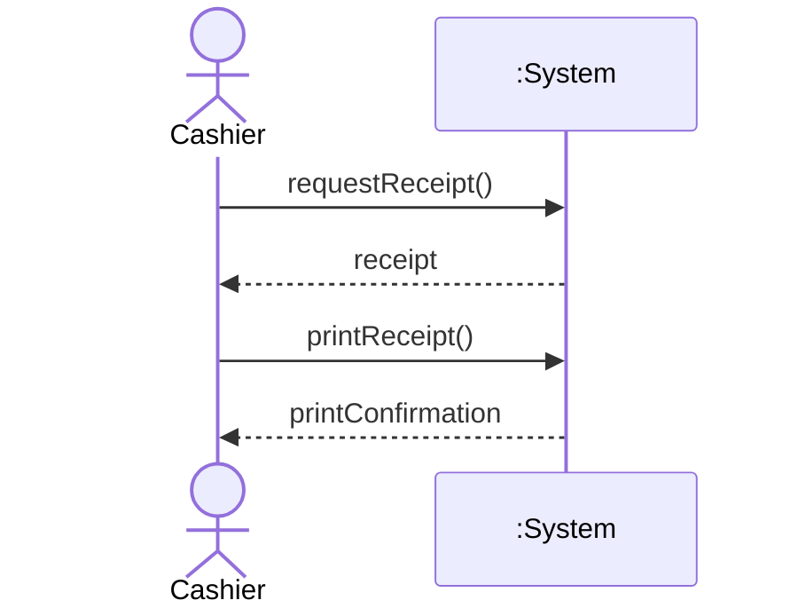
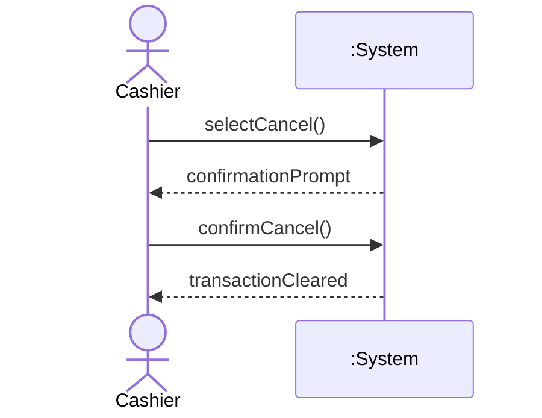
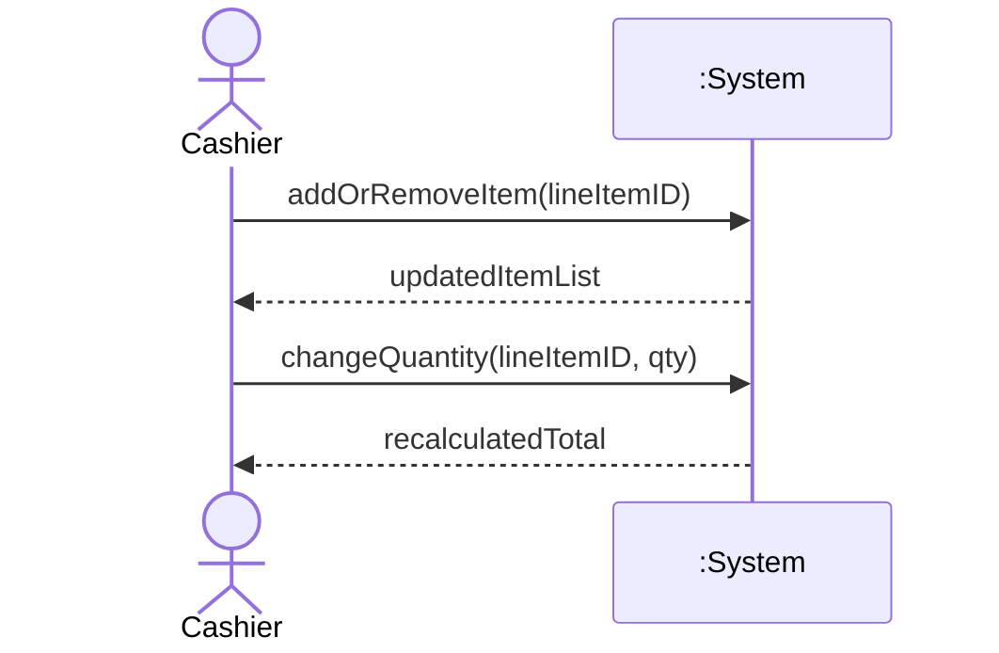
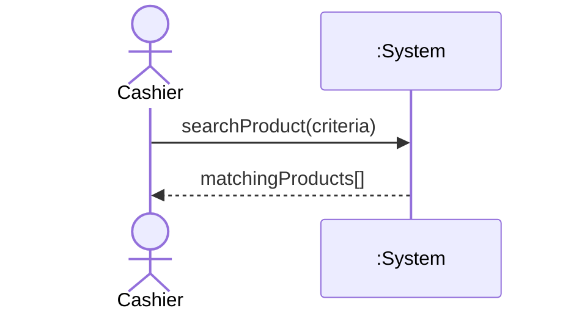
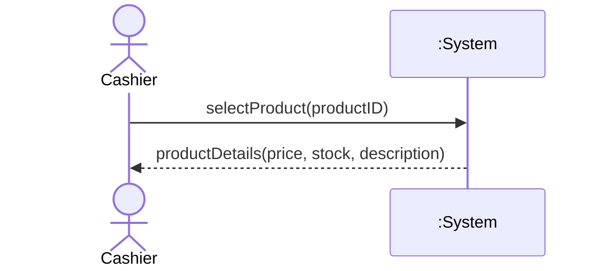
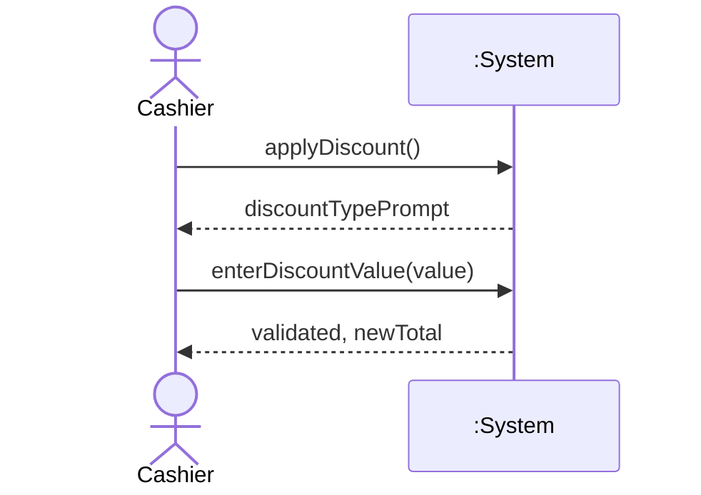
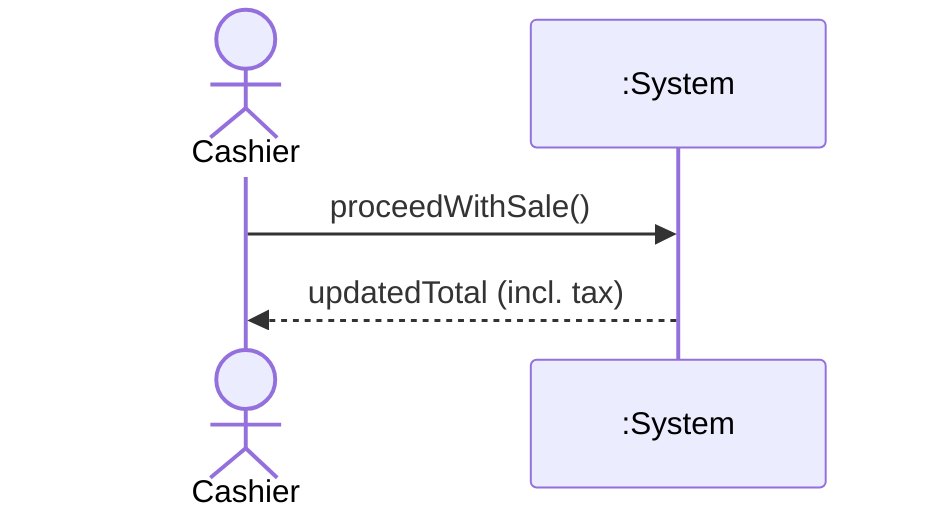
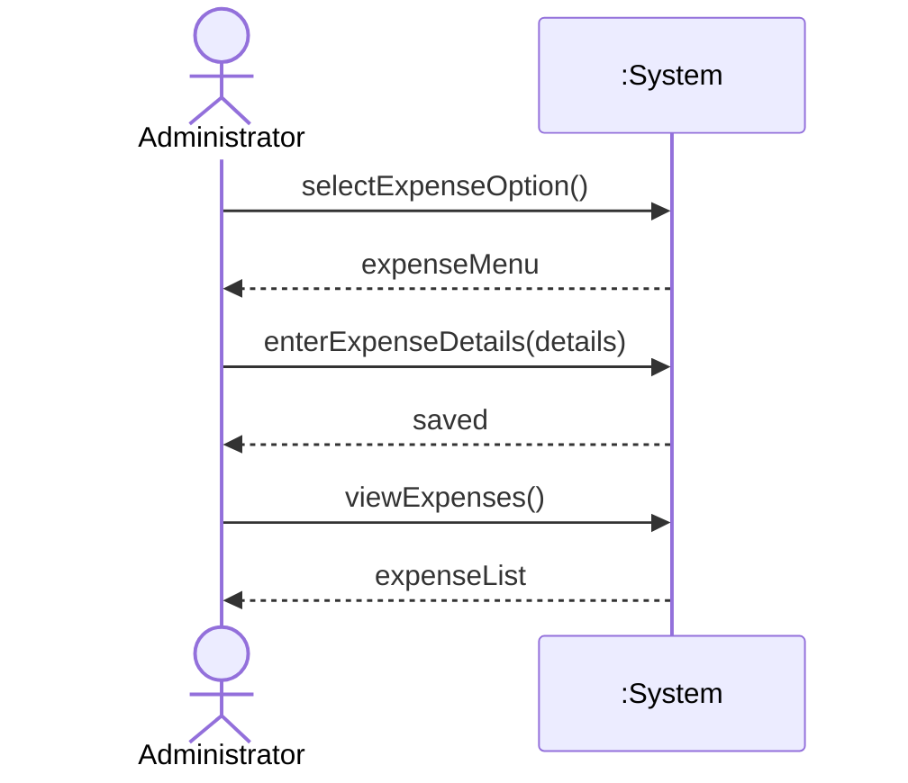

# Detailed Use Cases — Elaboration Iteration 1 (≈30%)

---

## UC1: Process Sale

**SSD:**

---

## UC2: Generate Receipt

**SSD:**

---

## UC3: Cancel Transaction

**SSD:**

---

## UC4: Modify Transaction

**SSD:**

---

## UC5: Search Product

**SSD:**

---

## UC6: View Product Details

**SSD:**

---

## UC7: Apply Discount

**SSD:**

---

## UC8: Apply Tax

**SSD:**

---

## UC9: Manage Expenses

**SSD:**
