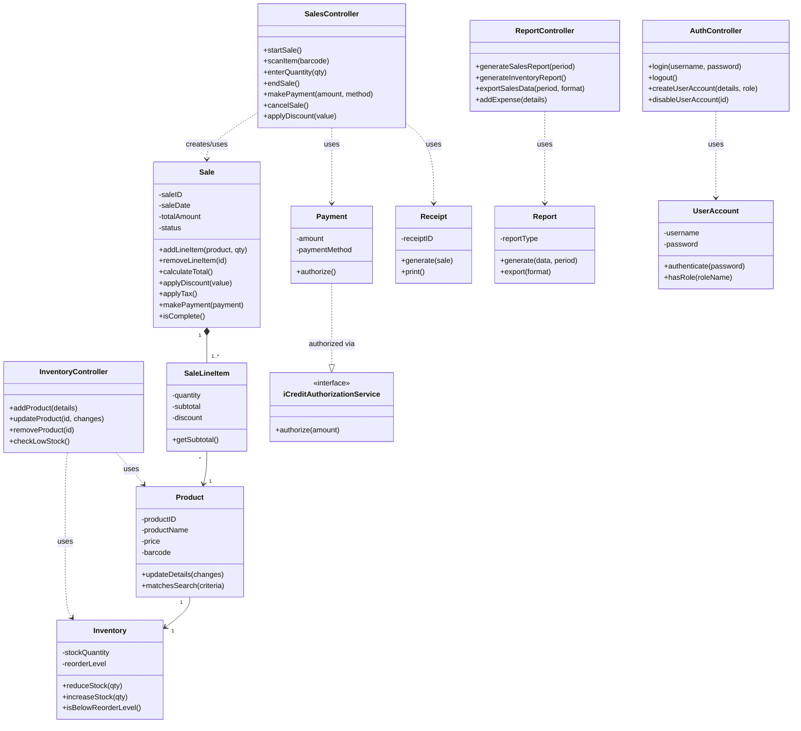

# Design Class Diagram — Elaboration Iteration 2

*Refines the conceptual `domain_model.md` into a design-level model: methods are added to the domain classes, and Controller classes are introduced to receive system operations from the UI, using GRASP patterns*

## GRASP Patterns Applied

- **Controller:** rather than one controller per use case (which would create a "bloated controller" for a system with 18 use cases), system operations are grouped into four session/façade controllers by subsystem: `SalesController`, `InventoryController`, `ReportController`, `AuthController`. Each sits in the Domain layer and is the first object the UI layer talks to (see `layered_architecture.md`).
- **Information Expert:** responsibilities are placed on the class that has the data needed to fulfil them — e.g. `Sale.calculateTotal()` lives on `Sale` because it owns the `SaleLineItem`s needed to compute it; `Inventory.isBelowReorderLevel()` lives on `Inventory` because it holds `stockQuantity` and `reorderLevel`.
- **Creator:** `Sale` creates its own `SaleLineItem` instances (`addLineItem`), since Sale contains and records them (Larman's Creator pattern: B should create A if B contains or records A).
- **Low Coupling / Polymorphism:** `Payment` is authorized through the `iCreditAuthorizationService` interface (already in `layered_architecture.md`) rather than the domain code depending directly on `bank payment` or `credit payment` — a new payment method can be added without touching `SalesController` or `Sale`.

## Controller Classes

| Controller | Handles use cases | Key methods |
|---|---|---|
| `SalesController` | Process Sale, Cancel Transaction, Modify Transaction, Apply Discount, Apply Tax, Generate Receipt | `startSale()`, `scanItem(barcode)`, `enterQuantity(qty)`, `endSale()`, `makePayment(amount, method)`, `cancelSale()`, `applyDiscount(value)` |
| `InventoryController` | Add Product, Update Product Information, Remove Product, Receive Low Stock Alert | `addProduct(details)`, `updateProduct(id, changes)`, `removeProduct(id)`, `checkLowStock()` |
| `ReportController` | View Sales Report, View Inventory Report, Export Sales Data, Manage Expenses | `generateSalesReport(period)`, `generateInventoryReport()`, `exportSalesData(period, format)`, `addExpense(details)` |
| `AuthController` | Login to System, Manage User Accounts | `login(username, password)`, `logout()`, `createUserAccount(details, role)`, `disableUserAccount(id)` |

## Domain Classes with Methods

| Class | Key methods (beyond attributes already in `domain_model.md`) |
|---|---|
| `Sale` | `addLineItem(product, qty)`, `removeLineItem(id)`, `calculateTotal()`, `applyDiscount(value)`, `applyTax()`, `makePayment(payment)`, `isComplete()` |
| `SaleLineItem` | `getSubtotal()` |
| `Product` | `updateDetails(changes)`, `matchesSearch(criteria)` |
| `Inventory` | `reduceStock(qty)`, `increaseStock(qty)`, `isBelowReorderLevel()` |
| `Payment` | `authorize()` — delegates to `iCreditAuthorizationService` |
| `Receipt` | `generate(sale)`, `print()` |
| `Report` | `generate(data, period)`, `export(format)` |
| `UserAccount` | `authenticate(password)`, `hasRole(roleName)` |

## Design Class Diagram

*Attributes are shown as private (`-`) and methods as public (`+`), consistent with standard UML visibility notation.*